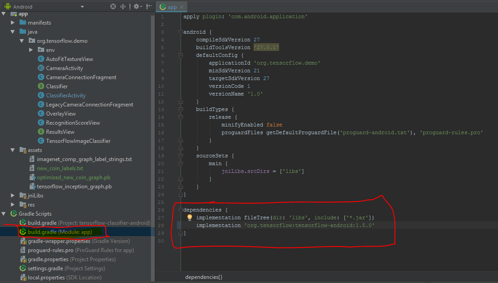

# Trouble Shooting for Project

## Error with Pip or Python Commands
    If you are seeing errors such as “unknown command” make sure that python and pip are in your system environment variables.
1.	Go to system properties and click on the “Environment Variables” button
2.	Go to the “Path Environment Variable” and click “Edit”
3.	From here you want to make sure that both “pip3.exe” and “python.exe” are included in here as such

## Error with Android Project not Compiling
Depending on the error one fix that I discovered was to go into the Gradle scripts to the build.gradle (Module: app) file and changing the implementation to “implementation ‘org.tensorflow:tensorflow-android:1.5.0”: 

## Other Errors:
I’d suggest StackOverflow or google because that helped me the most……. Best of Luck!
